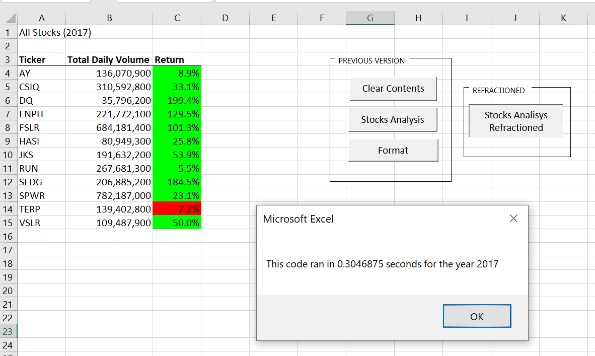
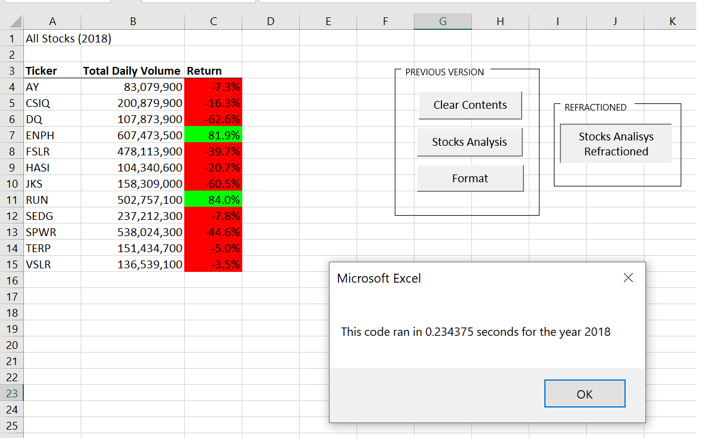

# stock-analysis

## Overview

This analysis looks at volume and return on certain stocks over a given year with given data. This will help in making investment decisions.The project also contains modular code that should make it easy to edit, or run further analysis on similarly formatted data in the future. 

## Results

The selected stocks performed, on average, better in 2017 than 2018. The refractured code ran faster than the previous version. 

### 2017

All of the sampled green stocks had positive returns in 2017, aside from TERP, which had a low negative return. DQ, SEDG, ENPH and FSLR all had returns above 100%. 

The runtime for the code in 2017 was 0.3046875 seconds.

### 2018

By contrast, the returns in 2018 on the same stocks were on average megative. RUN and ENPH continued to turn profitable, with a much better year for RUN than 2017, but the rest of the stocks listed were in negative returns. 

The runtime for the code in 2018 was 0.234375, slightly faster than for the data in 2017

## Summary 

### Notes on Refactoring code

Code Refactoring is a way of restructuring and optimizing existing code without changing its behavior. It is a way to improve the code quality. 

Code should be refactored on the below points
- Chances of Enhancement are high
- Code Smell is Detected (bad patterns)
- Bug of System Glitch Fixing
- Peer Review

Code should not be refactored on below cases
- Delivery Deadline is near and new development is planned.
- The cost of refactoring is higher than rewriting the code from scratch.
- Don't refactor the code if you don't have the time to test the refactored code before release. It can introduce new bugs. 
- Stable code should not be refactored.

Code Refactoring is an important exercise to remove code smell. It helps to find bugs, makes programs run faster, it's easier to understand the code, improves the design of software, etc. 

### Refactoring code for stock analysis code

In this context, the code used had nested `For` loops, which mean it ran through the code more than needed. When we refactored it, I used a ticker index, which allowed it to run wihout the nested loops, now It runs faster, is cleaner, and easier to understand. 

- The unrefactored code version, make its analysis in 1.27348 seconds for 2017 dataset, aproximatelly 4.17 times slower than the refractored version witch runs in 0.3046875 seconds.

However, both versions of the code performed the same critical function, and in this size of a data set, the delay in processing the code is not critical. It will work better and faster when retooled to work with bigger datasets.
